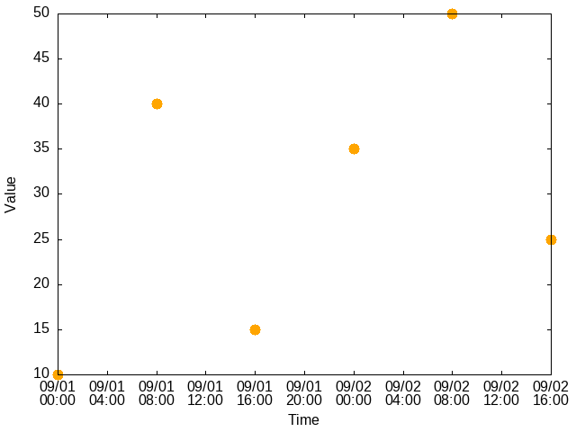

# `tempo`: manipulation de séries temporelles

L'application `tempo` sert à manipuler des [séries
temporelles](https://fr.wikipedia.org/wiki/S%C3%A9rie_temporelle) (aussi
appelées *séries chronologiques*), c'est-à-dire « une suite de valeurs
numériques représentant l'évolution d'une quantité spécifique dans le temps ».

## Dépendances

Afin de construire l'application, il faut avoir installé les éléments suivants:

* [GCC](https://gcc.gnu.org/): le compilateur C de GNU. Celui-ci peut être
  installé à l'aide d'un gestionnaire de paquets
* [Make](https://www.gnu.org/software/make/): un outil en ligne de commande
  facilitant la mise en place de tâches automatiques. Cet outil peut aussi être
  installé à l'aide d'un gestionnaire de paquets.

L'application dépend aussi des éléments suivants, qui sont livrés dans le dépôt afin de faciliter l'installation:

* [Bats](https://github.com/bats-core/bats-core): une suite d'application
  facilitant la mise en place de tests unitaires shell. Il n'est pas nécessaire
  d'installer Bats, qui est livré avec ce dépôt dans le répertoire `bats`

## Installation

### Construction (*build*)

Une fois les dépendances installées, on peut compiler l'application `tempo`
à l'aide de la commande `make`:

```sh
$ make
# Ou de façon équivalente
$ make build
```

Cette commande produit entre autres l'exécutable principal `tempo` dans le
répertoire `bin`.

Il est possible en tout temps de nettoyer les fichiers générés, incluant l'exécutable, à l'aide de la commande suivante:

```sh
$ make clean
```

### Tests

On peut aussi lancer la suite de tests Bats à l'aide de `make`:

```sh
$ make test
```

Un rapport Bats est alors affiché sur la sortie standard.

## Mise en contexte

Une *horodate* est un instant donné (en anglais, *timestamp*) et une *valeur*
est une quantité quelconque qu'on associe à cette horodate. Une paire $`(t,
v)`$, où $`t`$ est une horodate et $`v`$ une valeur, est donc appelée une
*observation*. Une *série temporelle* peut donc être vue comme un ensemble
d'observations. L'application `tempo` lit une série temporelle $`T`$ sur
l'entrée standard (`stdin`), puis affiche sur la sortie standard (`stdout`)
différentes informations sur $`T`$.

Considérons le flux de texte suivant, qui décrit une série temporelle de six
observations:

```
2025-09-01T00:00:00
0 10
28800 40
57600 15
86400 35
115200 50
144000 25
```

Plus spécifiquement:

* La première ligne du flux (`2025-09-01T00:00:00`) indique l'horodate de
  référence de la série temporelle au format `AAAA-mm-JJTHH:MM:SS`. Ce format
  est notamment reconnu par les standards
  [ISO8601](https://en.wikipedia.org/wiki/ISO_8601) et
  [RFC3339](https://datatracker.ietf.org/doc/html/rfc3339)
* Les lignes suivantes du flux de texte contiennent les observations, une
  observation par ligne
* Une observation est une ligne contenant deux valeurs, séparées par une ou
  plusieurs espaces (par exemple, `28800 40`)
* La première valeur d'une observation (par exemple `28800`) est un entier
  positif ou nul correspondant au décalage (en secondes) du moment où
  l'observation est effectuée par rapport à l'horodate de référence
  (`2025-09-01T00:00:00`)
* La seconde valeur d'une observation (par exemple `40`) est un entier
  correspondant à la valeur observée

Une représentation graphique de la série temporelle ci-haut est disponible dans
le fichier PNG suivant:


Plus généralement, pour être valide, un flux de texte doit respecter les
contraintes suivantes:

1. La première ligne du texte doit contenir une horodate valide respectant le
   format `AAAA-mm-JJTHH:MM:SS`
2. Chacune des autres lignes doit contenir une observation, c'est-à-dire
   qu'elle doit avoir une correspondance complète avec l'expression régulière
   étendue (ERE)
   `OFFSET[:blank:]*VALUE[:blank:]*`,
   où
    * `OFFSET` est un entier non négatif
    * `VALUE` est un entier
3. Un *entier* est une chaîne de caractères qui a une correspondance complète
   avec l'ERE `0|([-]?[1-9][0-9]*)`;
4. Un *entier non négatif* est une chaîne de caractères qui a une
   correspondance complète avec l'ERE `0|([1-9][0-9]*)`;

Des exemples de séries temporelles valides (extension `.ts`) et invalides
(extension `.invalid`) sont donnés dans le répertoire [`examples`](examples).

## Utilisation

L'application `tempo` utilise des *sous-commandes* afin de préciser
l'information qu'on souhaite afficher à propos d'une série temporelle. Pour le
moment, les quatre sous-commandes suivantes sont supportées:

1. `tempo describe`
2. `tempo help`
2. `tempo interpolate`
3. `tempo show`

Elles sont détaillées dans les sous-sections qui suivent.

## La sous-commande `help`

Lorsque vous lancez le programme avec la sous-commande `help`, un manuel
d'utilisation s'affiche sur la sortie standard:

```text
$ bin/tempo help
Usage: tempo SUBCOMMAND [options]
Displays information about a timeseries.

SUBCOMMAND is mandatory and must take one of the following values:
  describe: describes the timeseries
    -J|--from-json: read timeseries from JSON format
  help: shows this message
  interpolate: list the interpolations of the timeseries
    -J|--from-json: read timeseries from JSON format
    -s|--step DURATION: the duration of each interpolation step
  show: list the observations of the timeseries
    -J|--from-json: read timeseries from JSON format

A timeseries is a text stream that must satisfy the following syntax:

  1. The first line must contain a valid reference datetime with format
       YYYY-mm-DDTHH:MM:SS
     where YYYY are the 4 digits for the year,
           mm are the 2 digits for the month,
           DD are the 2 digits for the day,
           HH are the 2 digits for the hour,
           MM are the 2 digits for the minutes and
           SS are the 2 digits for the seconds
  2. Each of the remaining line must contain an observation, given with the
     format
       OFFSET VALUE
     where OFFSET is a positive integer indicating the number of seconds offset
                  with respect to the reference datetime and
           VALUE is an integer

When using -J|--from-json, the input must be a JSON object with:
  - "origin": a string with format YYYY-mm-DDTHH:MM:SS
  - "observations": an array of objects with "offset" and "value" fields
```

## La sous-commande `show`

La sous-commande `show` affiche la série temporelle sur la sortie standard dans
un format différent de celui considéré lors de la lecture. Plus précisément,
elle affiche en ordre chronologique chacune des observations, en commençant par
l'horodate de l'observation, suivie par la valeur observée, en utilisant une
espace comme séparateur.

Par exemple, si on reprend la série temporelle illustrée plus haut (voir fichier
[`examples/6.ts`](examples/6.ts)), alors on obtient ceci:

```
$ bin/tempo show < examples/6.ts
2025-09-01T00:00:00 10
2025-09-01T08:00:00 40
2025-09-01T16:00:00 15
2025-09-02T00:00:00 35
2025-09-02T08:00:00 50
2025-09-03T00:00:00 25
```

Ainsi, la commande affiche les 6 observations contenues dans la série
temporelle, en ordre chronologique, en utilisant l'espace comme séparateur.
Chaque observation est donnée par une paire d'horodate et de valeur entière.

## La sous-commande `describe`

La sous-commande `describe` affiche différentes informations à propos de la
série temporelle:

* Son *domaine* (*domain*): le plus petit intervalle temporel recouvrant toutes
  les horodates des observations
* Son *codomaine* (*codomain*): le plus petit intervalle de valeurs recouvrant
  toutes les valeurs des observations
* Sa *taille* (*size*): le nombre d'observations qu'elle contient
* Sa *durée* (*duration*): l'écart (en secondes) entre l'horodate de la
  dernière observation et l'horodate de la première observation
* Son *amplitude* (*amplitude*): l'écart entre la plus grande valeur observée
  et la plus petite valeur observée

Toujours avec l'exemple précédent:

```
$ bin/tempo describe < examples/6.ts
Domain: [2025-09-01T00:00:00, 2025-09-03T00:00:00]
Codomain: [10, 50]
Size: 6
Duration: 172800
Amplitude: 40
```

## La sous-commande `interpolate`

La sous-commande `interpolate` est similaire à la sous-commande `show`, mais
affiche les interpolations en plus des observations contenues dans la série
temporelle sur la sortie standard.

Par exemple, si on prend la série temporelle décrite dans le fichier
[`examples/3_10s.ts`](examples/3_10s.ts)), alors on obtient ceci:

```
$ bin/tempo interpolate < examples/3_10s.ts
2025-09-01T09:00:00 10
2025-09-01T09:00:01 12
2025-09-01T09:00:02 14
2025-09-01T09:00:03 16
2025-09-01T09:00:04 18
2025-09-01T09:00:05 20
2025-09-01T09:00:06 19
2025-09-01T09:00:07 18
2025-09-01T09:00:08 17
2025-09-01T09:00:09 16
2025-09-01T09:00:10 15
```

Ainsi, la commande affiche les 3 observations contenues dans la série
temporelle, en ordre chronologique, ainsi que toutes les valeurs interpolées
entre ces observations, pour chaque seconde.

Par défaut, un pas d'une seconde est utilisé pour chaque interpolation.
L'option `-s|--step N[smh]` permet de spécifier la durée du pas de temps entre
chaque interpolation, où `N` est un entier strictement positif et `[smh]` est
un caractère parmi `s` (secondes), `m` (minutes) et `h` (heures).

Par exemple, en reprenant la série [`3_10s`](examples/3_10s.ts), pour
interpoler selon un pas de 4 secondes, on peut donc entrer la commande
suivante (noter que l'interpolation commence à l'horodate de départ et qu'elle
continue tant qu'on n'a pas dépassé l'horodate de fin):

```
$ bin/tempo interpolate -s 4s < examples/3_10s.ts
2025-09-01T09:00:00 10
2025-09-01T09:00:04 18
2025-09-01T09:00:08 17
```

## Support du format JSON

En plus du format texte standard, les sous-commandes `describe`, `show` et `interpolate` supportent l'option `-J|--from-json` pour lire des séries temporelles au format JSON.

### Format JSON

Une série temporelle peut être représentée au format JSON avec la structure suivante :

```json
{
  "origin": "2025-09-01T00:00:00",
  "observations": [
    {"offset": 0, "value": 10},
    {"offset": 28800, "value": 40},
    {"offset": 57600, "value": 15},
    {"offset": 86400, "value": 35},
    {"offset": 115200, "value": 50},
    {"offset": 144000, "value": 25}
  ]
}
```

Où :
* `"origin"` : une chaîne de caractères contenant l'horodate de référence au format `YYYY-mm-DDTHH:MM:SS`
* `"observations"` : un tableau d'objets, où chaque objet contient :
  * `"offset"` : un entier non négatif représentant le décalage en secondes par rapport à l'horodate de référence
  * `"value"` : un entier représentant la valeur observée

Cette représentation JSON est équivalente au format texte suivant :

```
2025-09-01T00:00:00
0 10
28800 40
57600 15
86400 35
115200 50
144000 25
```

### Exemples d'utilisation

#### Afficher les statistiques d'une série temporelle JSON

```sh
$ bin/tempo describe -J < serie.json
Domain: [2025-09-01T00:00:00, 2025-09-02T16:00:00]
Codomain: [10, 50]
Size: 6
Duration: 144000
Amplitude: 40
```

#### Afficher les observations d'une série temporelle JSON

```sh
$ bin/tempo show --from-json < serie.json
2025-09-01T00:00:00 10
2025-09-01T08:00:00 40
2025-09-01T16:00:00 15
2025-09-02T00:00:00 35
2025-09-02T08:00:00 50
2025-09-02T16:00:00 25
```

#### Interpoler une série temporelle JSON

```sh
$ bin/tempo interpolate -J -s 1h < serie.json
2025-09-01T00:00:00 10
2025-09-01T01:00:00 11
2025-09-01T02:00:00 13
...
```

Les options `-J` et `--from-json` sont interchangeables et peuvent être combinées avec d'autres options. Par exemple :

```sh
# L'ordre des options est flexible
$ bin/tempo interpolate -s 8h -J < serie.json
$ bin/tempo interpolate -J -s 8h < serie.json

# Forme courte et forme longue
$ bin/tempo describe -J < serie.json
$ bin/tempo describe --from-json < serie.json
```

### Dépendances supplémentaires

Le support du format JSON nécessite la bibliothèque [Jansson](https://github.com/akheron/jansson).

#### Installation sur Ubuntu/Debian

```sh
$ sudo apt-get update
$ sudo apt-get install libjansson-dev
```

#### Installation depuis les sources

```sh
$ curl -L -o jansson.tar.gz https://digip.org/jansson/releases/jansson-2.13.tar.gz
$ tar -xzf jansson.tar.gz
$ cd jansson-2.13
$ ./configure
$ make
$ sudo make install
```

Une fois Jansson installé, vous pouvez compiler l'application normalement avec `make`.
